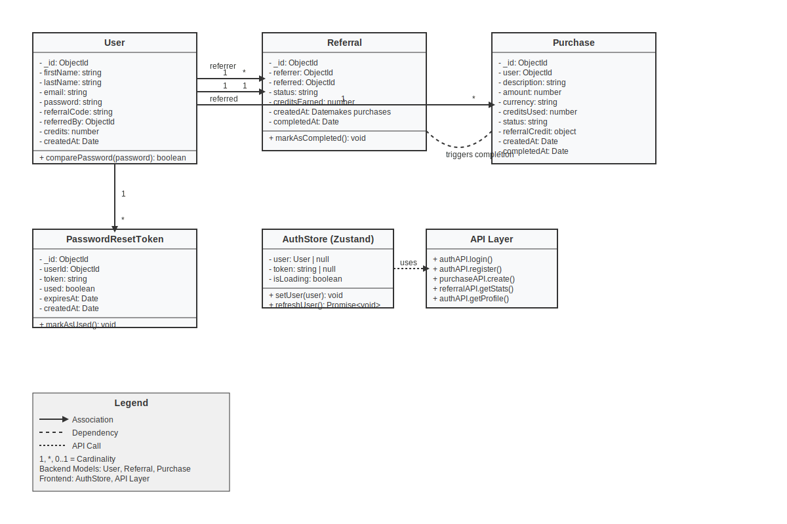
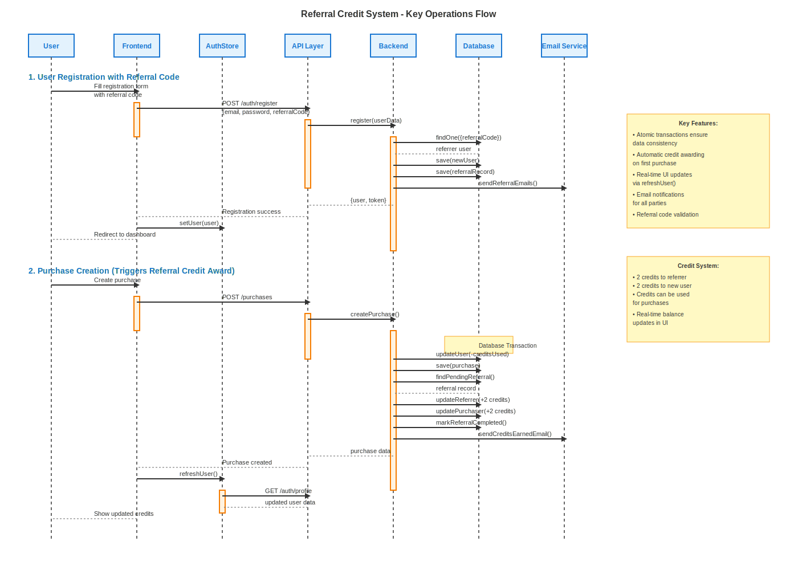
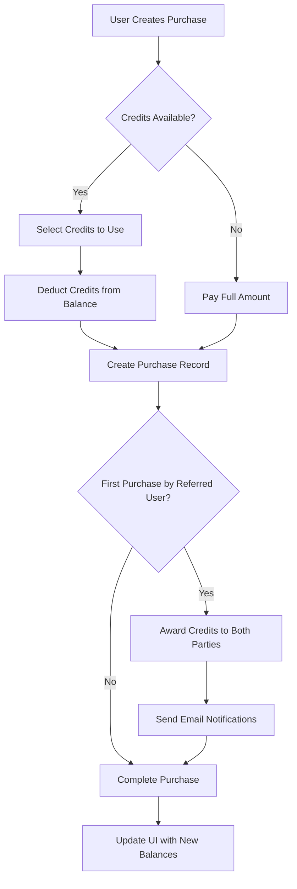

# ReferLink - Referral Credit System

A comprehensive full-stack application implementing a referral and credit system with user authentication, purchase management, and automated credit rewards.

## 🏗️ System Architecture

### Technology Stack

**Backend:**

- **Runtime:** Node.js with TypeScript
- **Framework:** Express.js
- **Database:** MongoDB with Mongoose ODM
- **Authentication:** JWT (JSON Web Tokens)
- **Email Service:** Nodemailer
- **Security:** bcryptjs, helmet, express-rate-limit
- **Validation:** express-validator

**Frontend:**

- **Framework:** Next.js 16 with React 19
- **Language:** TypeScript
- **Styling:** Tailwind CSS 4
- **State Management:** Zustand
- **HTTP Client:** Axios
- **UI Enhancements:** Framer Motion, React Hot Toast

### Architecture Overview

```
┌─────────────────┐    ┌─────────────────┐    ┌─────────────────┐
│   Frontend      │    │   Backend       │    │   Database      │
│   (Next.js)     │◄──►│   (Express)     │◄──►│   (MongoDB)     │
│                 │    │                 │    │                 │
│ • Pages         │    │ • Controllers   │    │ • Users         │
│ • Components    │    │ • Models        │    │ • Referrals     │
│ • Stores        │    │ • Routes        │    │ • Purchases     │
│ • API Layer     │    │ • Middleware    │    │ • Tokens        │
└─────────────────┘    └─────────────────┘    └─────────────────┘
```

## 📊 UML Diagrams

### Class Diagram



The class diagram shows the relationships between:

- **User**: Core entity with authentication and referral data
- **Referral**: Tracks referral relationships and status
- **Purchase**: Records transactions and credit usage
- **PasswordResetToken**: Manages secure password resets
- **Frontend Stores**: State management and API integration

### Sequence Diagram



The sequence diagram illustrates:

1. **User Registration Flow**: With referral code validation and relationship creation
2. **Purchase Creation Flow**: Triggering automatic credit awards and notifications

## 🚀 Quick Start

### Prerequisites

- Node.js (v18 or higher)
- MongoDB (local or cloud instance)
- npm or yarn package manager

### Installation

1. **Clone the repository:**

   ```bash
   git clone <repository-url>
   cd referral-credit-system
   ```

2. **Backend Setup:**

   ```bash
   cd backend
   npm install
   ```

3. **Frontend Setup:**

   ```bash
   cd frontend
   npm install
   ```

4. **Environment Configuration:**

   Create `backend/.env`:

   ```env
   # Database
   MONGODB_URI=mongodb://localhost:27017/referral-credit-system

   # JWT
   JWT_SECRET=your-super-secret-jwt-key-here
   JWT_EXPIRES_IN=7d

   # Server
   PORT=5000
   NODE_ENV=development

   # Frontend URL (for CORS and email links)
   FRONTEND_URL=http://localhost:3000

   # Email Configuration (Gmail example)
   EMAIL_HOST=smtp.gmail.com
   EMAIL_PORT=587
   EMAIL_SECURE=false
   EMAIL_USER=your-email@gmail.com
   EMAIL_PASS=your-app-password
   EMAIL_FROM=your-email@gmail.com
   ```

5. **Start the Application:**

   **Option A - Start both services:**

   ```bash
   cd backend
   npm run dev:full
   ```

   **Option B - Start separately:**

   ```bash
   # Terminal 1 - Backend
   cd backend
   npm run dev

   # Terminal 2 - Frontend
   cd frontend
   npm run dev
   ```

6. **Access the Application:**
   - Frontend: http://localhost:3000
   - Backend API: http://localhost:5000

## 🏛️ System Architecture Deep Dive

### Backend Architecture

#### Models & Database Schema

**User Model:**

```typescript
{
  firstName: string,
  lastName: string,
  email: string (unique),
  password: string (hashed),
  referralCode: string (unique, auto-generated),
  referredBy: ObjectId (optional),
  credits: number (default: 0),
  createdAt: Date,
  updatedAt: Date
}
```

**Referral Model:**

```typescript
{
  referrer: ObjectId (User who referred),
  referred: ObjectId (User who was referred),
  status: 'pending' | 'completed',
  creditsEarned: number (default: 0),
  createdAt: Date,
  completedAt: Date (optional)
}
```

**Purchase Model:**

```typescript
{
  user: ObjectId,
  description: string,
  amount: number,
  currency: string (default: 'USD'),
  creditsUsed: number (default: 0),
  status: 'pending' | 'completed' | 'failed',
  referralCredit: {
    referrer: ObjectId,
    amount: number
  } (optional),
  createdAt: Date,
  completedAt: Date (optional)
}
```

#### API Endpoints

**Authentication Routes (`/api/auth`):**

- `POST /register` - User registration with optional referral code
- `POST /login` - User authentication
- `GET /profile` - Get current user profile
- `POST /forgot-password` - Request password reset
- `POST /reset-password` - Reset password with token

**Purchase Routes (`/api/purchases`):**

- `POST /` - Create new purchase (triggers credit awards)
- `GET /` - Get user's purchase history

**Referral Routes (`/api/referrals`):**

- `GET /stats` - Get referral statistics
- `GET /validate/:code` - Validate referral code
- `GET /recent` - Get recent referrals
- `GET /history` - Get complete referral history

#### Middleware Stack

1. **Security Middleware:**

   - Helmet for security headers
   - CORS for cross-origin requests
   - Rate limiting for API protection

2. **Authentication Middleware:**

   - JWT token verification
   - User context injection

3. **Validation Middleware:**
   - Request body validation
   - Parameter sanitization

### Frontend Architecture

#### Component Structure

```
frontend/
├── app/                    # Next.js App Router
│   ├── dashboard/         # Dashboard page
│   ├── purchases/         # Purchase management
│   ├── referrals/         # Referral tracking
│   ├── analytics/         # Analytics dashboard
│   ├── login/            # Authentication
│   └── register/         # User registration
├── components/           # Reusable components
│   ├── auth/            # Authentication components
│   └── ui/              # UI components
├── store/               # State management
│   ├── authStore.ts     # Authentication state
│   └── referralStore.ts # Referral state
└── lib/                 # Utilities
    ├── api.ts           # API client
    └── validation.ts    # Form validation
```

#### State Management (Zustand)

**AuthStore:**

```typescript
interface AuthState {
  user: User | null;
  token: string | null;
  isLoading: boolean;
  setUser: (user: User) => void;
  setToken: (token: string) => void;
  logout: () => void;
  setLoading: (loading: boolean) => void;
  refreshUser: () => Promise<void>;
}
```

#### Key Features

1. **Responsive Design:** Mobile-first approach with Tailwind CSS
2. **Real-time Updates:** Automatic data refresh after transactions
3. **Form Validation:** Client-side validation with error handling
4. **Loading States:** User feedback during API operations
5. **Toast Notifications:** Success/error message system

## 💳 Credit System Logic

### How Credits Work

1. **Credit Award Mechanism:**

   - When a referred user makes their **first purchase**, both parties receive credits
   - **Referrer receives:** 2 credits
   - **Referred user receives:** 2 credits
   - Credits are awarded only once per referral relationship

2. **Credit Usage:**

   - Credits can be used to reduce purchase amounts
   - 1 credit = $1 discount
   - Users can use partial credits (e.g., use 5 credits on a $20 purchase)
   - Remaining amount must be paid through other means

3. **Credit Tracking:**
   - Real-time balance display in the UI
   - Credit usage history in purchase records
   - Analytics showing total credits earned from referrals

### Purchase Flow with Credits



## 🔄 Referral System Logic

### Referral Flow

1. **Code Generation:**

   - Unique 6-character alphanumeric codes
   - Generated during user registration
   - Collision detection ensures uniqueness

2. **Referral Process:**

   ```
   User A (Referrer) → Shares Code → User B (Referred) → Registers → Makes Purchase → Credits Awarded
   ```

3. **Status Tracking:**

   - **Pending:** User registered with code but hasn't purchased
   - **Completed:** User made first purchase, credits awarded

4. **Validation Rules:**
   - Users cannot refer themselves
   - Referral codes must exist and be valid
   - Credits awarded only on first purchase

### Referral Analytics

The system provides comprehensive analytics:

- **Total Referrals:** Count of all users referred
- **Successful Referrals:** Users who completed purchases
- **Pending Referrals:** Users who registered but haven't purchased
- **Conversion Rate:** Percentage of referrals that convert
- **Total Credits Earned:** Sum of all referral credits
- **Recent Activity:** Timeline of referral events

## 🛡️ Security Features

### Authentication & Authorization

1. **Password Security:**

   - bcryptjs hashing with salt rounds
   - Minimum password requirements
   - Secure password reset flow

2. **JWT Implementation:**

   - Stateless authentication
   - Configurable expiration
   - Secure token storage

3. **API Security:**
   - Rate limiting to prevent abuse
   - Input validation and sanitization
   - CORS configuration
   - Security headers via Helmet

### Data Protection

1. **Database Security:**

   - Mongoose schema validation
   - Indexed fields for performance
   - Atomic transactions for consistency

2. **Email Security:**
   - Secure SMTP configuration
   - Token-based password resets
   - Email verification workflows

## 📧 Email System

### Email Templates

1. **Welcome Email:** Sent to new users
2. **Referral Success:** Notifies referrer of successful referral
3. **Referral Welcome:** Welcomes referred users
4. **Credits Earned:** Notifies when credits are awarded
5. **Password Reset:** Secure password reset instructions
6. **Reset Confirmation:** Confirms successful password reset

### Configuration

The email system uses Nodemailer with support for:

- Gmail SMTP
- Custom SMTP servers
- HTML email templates
- Async sending (non-blocking)

## 🧪 Testing

### API Testing

The backend includes comprehensive test suites:

```bash
# Run all tests
npm run test

# Run comprehensive tests
npm run test:comprehensive

# Run API-specific tests
npm run test:api
```

### Test Coverage

- User registration and authentication
- Referral code validation
- Purchase creation and credit awards
- Email functionality
- Error handling scenarios

## 📈 Performance Considerations

### Database Optimization

1. **Indexing Strategy:**

   - Email field (unique index)
   - Referral codes (unique index)
   - User references in referrals and purchases

2. **Query Optimization:**
   - Pagination for large datasets
   - Selective field projection
   - Aggregation pipelines for analytics

### Frontend Optimization

1. **Code Splitting:** Next.js automatic code splitting
2. **State Management:** Efficient Zustand stores
3. **API Caching:** Strategic data fetching
4. **Image Optimization:** Next.js image optimization

## 🚀 Deployment

### Production Setup

1. **Environment Variables:**

   ```env
   NODE_ENV=production
   MONGODB_URI=mongodb+srv://...
   JWT_SECRET=production-secret
   FRONTEND_URL=https://yourdomain.com
   ```

2. **Build Commands:**

   ```bash
   # Backend
   npm run build
   npm start

   # Frontend
   npm run build
   npm start
   ```

3. **Deployment Options:**
   - **Backend:** Heroku, DigitalOcean, AWS EC2
   - **Frontend:** Vercel, Netlify, AWS S3 + CloudFront
   - **Database:** MongoDB Atlas, AWS DocumentDB

## 🔧 Development

### Adding New Features

1. **Backend:**

   - Create model in `/models`
   - Add controller in `/controllers`
   - Define routes in `/routes`
   - Add validation middleware

2. **Frontend:**
   - Create page in `/app`
   - Add components in `/components`
   - Update stores if needed
   - Add API calls in `/lib/api.ts`

### Code Style

- TypeScript for type safety
- ESLint for code quality
- Consistent naming conventions
- Comprehensive error handling

## 📝 API Documentation

### Response Format

All API responses follow this structure:

```typescript
{
  success: boolean,
  message: string,
  data?: any,
  error?: string
}
```

### Error Handling

- **400:** Bad Request (validation errors)
- **401:** Unauthorized (authentication required)
- **404:** Not Found (resource doesn't exist)
- **500:** Internal Server Error (server issues)

## 🤝 Contributing

1. Fork the repository
2. Create a feature branch
3. Make your changes
4. Add tests if applicable
5. Submit a pull request

## 📄 License

This project is licensed under the ISC License.

## 🆘 Support

For issues and questions:

1. Check the documentation
2. Review existing issues
3. Create a new issue with detailed information
4. Include error logs and reproduction steps

---

**Built with ❤️ using modern web technologies**
